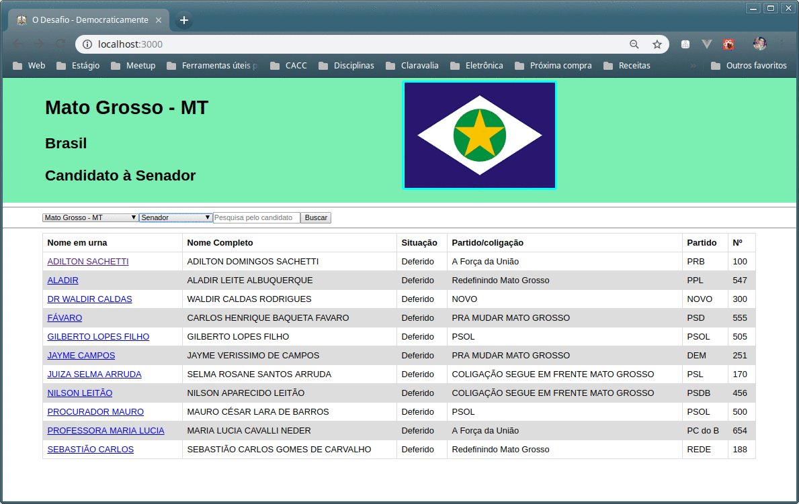

# Processo Seletivo Frontend Junior da Sigma/TJMT
Candidato: Cosme da Silva Lorim

## O Desafio - Projeto Democraticamente

Objetivo é criar aplicação Web utilizando a API do TSE (Tribunal Superior Eleitoral) como fonte de dados.

<p align="center">
  
</p>

## Pré-requisitos

  * Node.js 8.12 +
  * NPM 6.4 +
  * Git 1.9 +

## Como instalar 

  * Faça clone do projeto
  ```bash
  $ git clone https://github.com/CosmeLorim/sigma-challenge-jr.git
  ```
  * Acesse o diretório da aplicação
  ```bash
  $ cd sigma-challenge-jr/app
  ```
  * Faça download das dependências
  ```bash
  $ yarn install
  ```
  * Para iniciar servidor de desenvolvimento
  ```
  $ yarn start
  ```
  * Para fazer build para produção
  ```
  $ yarn build 
  ```

## Quadro no trello
  [Processo Seletivo SIGMA(TJMT)](https://trello.com/b/CWIzSUcq/processo-seletivo-sigmathmt)

## Discussões

Para iniciar uma discussão basta clicar em “New issue” na página de discussões. Se possível rotule a discussão com um tipo apropriado: Bug, Docs, Dúvida, Melhoria, Função, Manutenção, ou DevTools.